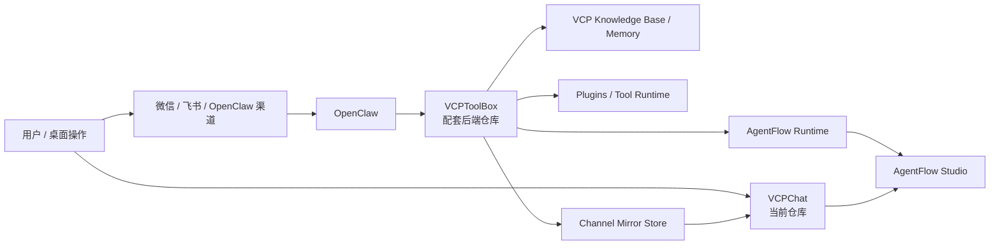
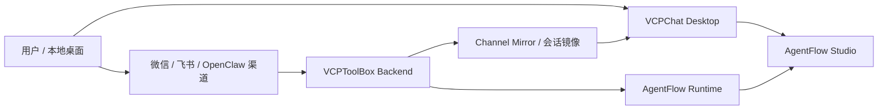

# VCPChat OpenClaw Fork

中文：这是面向本地桌面使用的 `VCPChat` 二开版前端，负责聊天界面、渠道镜像可视化、AgentFlow Studio 与分布式桌面展示。

English: This is a customized `VCPChat` desktop fork focused on chat UI, channel mirror visualization, AgentFlow Studio, and distributed desktop presentation.

[](https://github.com/hx676/vcpchat-openclaw)
[](https://github.com/hx676/vcptoolbox-openclaw)
[](https://github.com/hx676/vcptoolbox-openclaw)
[](https://github.com/hx676/vcpchat-openclaw/tree/main/AgentFlowStudio)
[](https://github.com/hx676/vcptoolbox-openclaw)
[](https://github.com/hx676/vcpchat-openclaw)

## 首页导航

| 入口 | 说明 |
| --- | --- |
| [当前仓库](https://github.com/hx676/vcpchat-openclaw) | `VCPChat` 桌面前端、镜像会话查看、AgentFlow Studio |
| [配套后端](https://github.com/hx676/vcptoolbox-openclaw) | `VCPToolBox` 后端、知识库、记忆、工具、OpenClaw 集成 |
| [前端文档目录](/E:/2026/VCPChat/docs/DOCUMENTATION_INDEX.md) | 当前仓库的文档入口 |
| [AgentFlow Studio](/E:/2026/VCPChat/AgentFlowStudio) | 独立前端工作区 |
| [上游项目](https://github.com/lioensky/VCPChat) | 原始 `VCPChat` 仓库 |

## 当前状态

- 当前仓库已经按个人二开版收口，不再是单纯的上游镜像。
- GitHub 首页已补齐 README、About、Description 和 Topics。
- 推荐阅读顺序是：`README -> docs -> paired repo -> 本地启动`。

## 安装前提

| 项目 | 建议 |
| --- | --- |
| 操作系统 | Windows 10 / 11 |
| Node.js | `>= 20.x` |
| npm | `>= 9.x` |
| Python | `>= 3.10`，用于部分音频/插件/扩展能力 |
| 配套后端 | 需要 [vcptoolbox-openclaw](https://github.com/hx676/vcptoolbox-openclaw) 在本机可用 |
| 推荐目录结构 | `E:\2026\VCPChat` 与 `E:\2026\VCPToolBox` 同级 |

## 总架构图



## 一眼看懂



这个仓库负责的是前端和可视化这一侧：

- 桌面聊天主客户端
- 渠道镜像会话查看
- AgentFlow Studio 前端工作区
- 分布式桌面能力与 `vcp_chat` 工具结果展示

## 截图预览

| 桌面主界面 | 另一套界面状态 |
| --- | --- |
|  |  |

| Agent / 会话展示 | 高级渲染示例 |
| --- | --- |
|  |  |

这是 `VCPChat` 的个人二次开发版本，仓库地址为：

- 前端客户端仓库：[hx676/vcpchat-openclaw](https://github.com/hx676/vcpchat-openclaw)
- 配套后端仓库：[hx676/vcptoolbox-openclaw](https://github.com/hx676/vcptoolbox-openclaw)
- 上游项目：[lioensky/VCPChat](https://github.com/lioensky/VCPChat)

本仓库的定位不是单独运行的聊天壳，而是配合 `VCPToolBox` 使用的桌面前端与可视化入口。当前二开重点已经收口到以下几个方向：

- `VCPChat` 桌面聊天客户端
- `OpenClaw + VCP` 联动后的会话可视化
- 微信 / 飞书等渠道镜像会话展示
- AgentFlow Studio 独立编排前端工作区
- 分布式桌面服务与 `vcp_chat` 工具链路联调

## 这个 Fork 做了什么

相对上游版本，这个仓库当前主要承载了以下定制方向：

- 接入 `OpenClaw` 相关前端配套能力
- 增强渠道镜像展示，让外部渠道消息可以进入 VCPChat 主列表可视化查看
- 增加 AgentFlow Studio 相关前端工作区和演示链路
- 增强与 `VCPToolBox` 的联动，适配当前本地部署方案
- 结合桌面 Distributed Server 做 `vcp_chat` 工具成功链路验证

如果你是从 GitHub 首页进入这个仓库，最应该先知道的一件事是：

> 这个仓库已经不是“纯上游原版”，而是和 `vcptoolbox-openclaw` 成对维护的本地集成版本。

## OpenClaw 直接怎么接到这里

当前实现里，OpenClaw 不是直接把聊天记录写进 VCPChat 的 `history.json`。

真正的链路是：

1. OpenClaw 安装本地桥接插件 `OpenClawmodules/vcp-openclaw-bridge`
2. 插件把渠道消息、VCP 工具结果、知识问答结果写到 `VCPToolBox` 的集成接口
3. `VCPToolBox` 再把这些内容归档到 `ChannelMirrorData`
4. `VCPChat` 读取 `ChannelMirrorData`，并把它们显示成 `channel_mirror` 类型会话

这也是为什么你现在在主列表里能看到飞书 / 微信镜像，但它们默认是只读的。

另外，VCPChat 还会从 `~/.openclaw/agents/<agentId>/sessions/*.jsonl` 做一层补全回填，所以你看到的时间线通常会比单纯的 `history.json` 更完整，尤其是：

- OpenClaw 实际发出的 assistant 回复
- 通过 OpenClaw 发出的文件附件

对应文档入口：

- [OPENCLAW_CHANNEL_MIRROR.md](./docs/OPENCLAW_CHANNEL_MIRROR.md)
- [后端集成逻辑](https://github.com/hx676/vcptoolbox-openclaw/blob/main/docs/OPENCLAW_INTEGRATION.md)

## 配套关系

完整运行通常需要两个仓库一起配合：

1. 后端运行 [vcptoolbox-openclaw](https://github.com/hx676/vcptoolbox-openclaw)
2. 前端桌面端运行当前仓库 `vcpchat-openclaw`

职责划分如下：

- `VCPToolBox`：模型调用、工具执行、记忆/RAG、OpenClaw 集成接口、渠道镜像落盘
- `VCPChat`：桌面聊天、会话查看、镜像展示、AgentFlow Studio 前端、分布式桌面端入口

## 快速开始

### 1. 安装依赖

```bash
npm install
```

### 2. 启动前确认

在启动当前仓库之前，建议先确保：

- `VCPToolBox` 已经安装依赖并启动
- 后端 `config.env` 已完成你的本机配置
- 如需使用分布式桌面能力，已在桌面设置中开启 Distributed Server

### 3. 启动桌面端

```bash
npm start
```

可用脚本：

- `npm start`：正常启动桌面端
- `npm run start:desktop`：仅启动桌面桌面层相关入口
- `npm run start:rag-observer`：仅启动 RAG 观察入口
- `npm run doctor`：做本地环境检查

## 一键启动

如果你本机目录结构是这样的：

```text
E:\2026\
├─ VCPChat
└─ VCPToolBox
```

那么最省事的启动方式是直接运行这些脚本：

- [一键启动VCPChat.bat](/E:/2026/VCPChat/一键启动VCPChat.bat)
  作用：自动寻找同级 `VCPToolBox`，补齐依赖，拉起后端，再启动桌面端。
- [start.bat](/E:/2026/VCPChat/start.bat)
  作用：只启动当前桌面端，并在启动前检查本仓库依赖。
- [launch-vchat.vbs](/E:/2026/VCPChat/launch-vchat.vbs)
  作用：无控制台窗口方式启动桌面端。
- [重启VCPChat.bat](/E:/2026/VCPChat/重启VCPChat.bat)
  作用：用于本地快速重启桌面客户端。

如果你需要先做环境体检，再决定是否启动：

- `npm run doctor`
- [VCPDoctor.bat](/E:/2026/VCPChat/VCPDoctor.bat)

## 常用目录

- [main.js](/E:/2026/VCPChat/main.js)：Electron 主进程入口
- [renderer.js](/E:/2026/VCPChat/renderer.js)：前端渲染主入口
- [AgentFlowStudio](/E:/2026/VCPChat/AgentFlowStudio)：AgentFlow 独立前端工作区
- [OpenClawmodules](/E:/2026/VCPChat/OpenClawmodules)：OpenClaw 相关桥接/模块
- [docs](/E:/2026/VCPChat/docs)：文档入口

## 文档入口

建议优先看这些文档：

- [DOCUMENTATION_INDEX.md](/E:/2026/VCPChat/docs/DOCUMENTATION_INDEX.md)
- [AGENT_PLACEHOLDER_CHEATSHEET.md](/E:/2026/VCPChat/docs/AGENT_PLACEHOLDER_CHEATSHEET.md)

如果你正在看 AgentFlow：

- 前端侧文档在 `VCPChat/docs`
- 后端 Runtime / Memory 文档在 `VCPToolBox/docs`

## 当前 Fork 的使用建议

这个仓库更适合下面几类用途：

- 作为你自己的 VCP 桌面主客户端
- 用来查看 OpenClaw 渠道镜像会话
- 配合 `VCPToolBox` 做知识库/记忆/工具链联动
- 运行和演示 AgentFlow Studio

不建议把这个 fork 直接当成“无配置即开箱”的纯净发布版，因为它已经包含了较多本地化定制与联调路径。

## 与上游差异

这个 fork 相对上游，已经明显偏向“个人集成版”而不是“纯前端壳”：

- 增加了与 `vcptoolbox-openclaw` 成对维护的说明与入口
- 强化了 OpenClaw 渠道镜像在桌面端的查看链路
- 加入了 AgentFlow Studio 作为独立前端工作区
- 已围绕 `vcp_chat` 分布式工具链路做本地联调和展示闭环
- 增加了更适合本地部署的批处理 / VBS 启动脚本

如果你想继续同步上游，建议把这个仓库看成“带本地集成假设的分支产品”，而不是直接覆盖上游版本。

## 与上游的关系

本仓库保留对上游项目的尊重与引用：

- 上游前端：[lioensky/VCPChat](https://github.com/lioensky/VCPChat)
- 上游后端：[lioensky/VCPToolBox](https://github.com/lioensky/VCPToolBox)

如果你想同步上游新能力，建议以当前仓库为主线，选择性从 upstream 合并，而不是直接覆盖本地定制。

## 说明

- 本仓库不会提交你的本地运行数据、账号信息和私有配置
- GitHub 上看到的是可公开部分，不包含你的本机环境密钥
- 若要完整跑通，请同时参考配套后端仓库的 README

## License

本 fork 继续尊重上游项目原有许可与署名要求。涉及二开部分，请结合上游仓库声明一并理解和使用。
