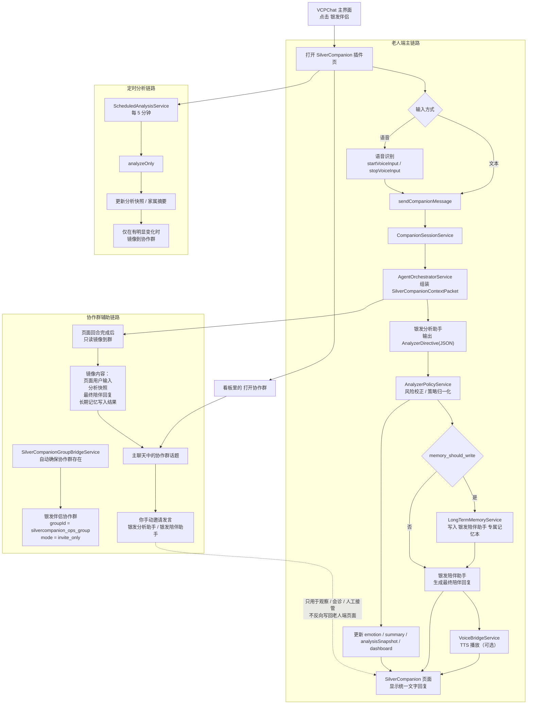

# SilverCompanion Current Flow

```mermaid
flowchart TD
    A["VCPChat 主界面<br/>点击 银发伴侣"] --> B["打开 SilverCompanion 插件页"]

    subgraph Main["老人端主链路"]
        B --> C{"输入方式"}
        C -->|文本| D["sendCompanionMessage"]
        C -->|语音| E["语音识别<br/>startVoiceInput / stopVoiceInput"]
        E --> D

        D --> F["CompanionSessionService"]
        F --> G["AgentOrchestratorService<br/>组装 SilverCompanionContextPacket"]

        G --> H["银发分析助手<br/>输出 AnalyzerDirective(JSON)"]
        H --> I["AnalyzerPolicyService<br/>风险校正 / 策略归一化"]

        I --> J{"memory_should_write"}
        J -->|是| K["LongTermMemoryService<br/>写入 银发陪伴助手 专属记忆本"]
        J -->|否| L["银发陪伴助手<br/>生成最终陪伴回复"]
        K --> L

        L --> M["VoiceBridgeService<br/>TTS 播放（可选）"]
        L --> N["SilverCompanion 页面<br/>显示统一文字回复"]
        M --> N

        I --> O["更新 emotion / summary / analysisSnapshot / dashboard"]
        O --> N
    end

    subgraph Ops["协作群辅助链路"]
        P["SilverCompanionGroupBridgeService<br/>自动确保协作群存在"] --> Q["银发伴侣协作群<br/>groupId = silvercompanion_ops_group<br/>mode = invite_only"]
        R["页面回合完成后<br/>只读镜像到群"] --> S["镜像内容：<br/>页面用户输入<br/>分析快照<br/>最终陪伴回复<br/>长期记忆写入结果"]
        S --> T["主聊天中的协作群话题"]
        T --> U["你手动邀请发言<br/>银发分析助手 / 银发陪伴助手"]
    end

    G --> R
    B --> V["看板里的 打开协作群"] --> T

    subgraph Timer["定时分析链路"]
        W["ScheduledAnalysisService<br/>每 5 分钟"] --> X["analyzeOnly"]
        X --> Y["更新分析快照 / 家属摘要"]
        Y --> Z["仅在有明显变化时<br/>镜像到协作群"]
    end

    B --> W
    U -. "只用于观察 / 会诊 / 人工接管<br/>不反向写回老人端页面" .-> N
```

## Notes

- `银发伴侣页面` 是主入口。
- `银发分析助手 -> 银发陪伴助手` 是主回复链。
- `银发伴侣协作群` 是旁路观察、会诊和人工介入入口，不直接替代老人端页面回复。
